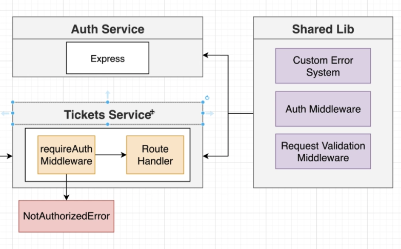

# Common
We are going to share our code in npm package, in our organization registery



Navigate to `https://www.npmjs.com/~btabe0914`
1. Create an organization --> lem-vr
2. Add "name": "@lem-vr/common" to package json
3. Add "version": "1.0.0"
4. git init in common folder
5. git add .
6. git commit -m "message"
7. npm login
8. npm publish --access public or without --access public for private oganization

# Packages
Install typescript config
```
tsc --init
```

Change the import flag to, it means when import any module we import from the following path

```
"main": "./build/index.js",
"types": "./build/index.d.ts",
"files": [ ---> What we want npm to inclide in final version of package
  "build/**/*"
],

```
